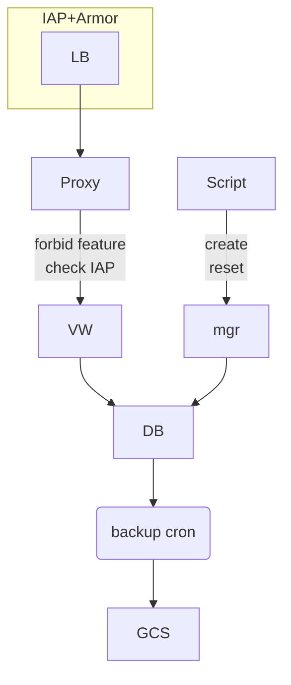

# Architecture

```mermaid
graph TD
    LB --> Proxy
    Proxy -->|forbid feature<br>check IAP| VW
    VW --> DB
    DB --> Backup(backup cron)
    Backup(backup cron) --> GCS

    Script -->|create<br>reset| mgr
    mgr --> DB

    subgraph IAP+Armor
        LB
    end
```
