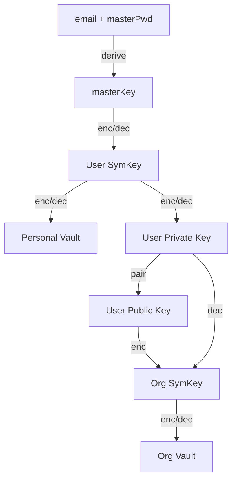

# Flow

## Pseudo-Code

```js
// user to enc/dec org level items
org.symKey = ("decrypte from operating admin's userOrg.encOrgKey")

user.uuid = randUUID()
user.email = (assigned by cmpy)
// userMasterPwd input by user, not sent by API or stored in DB
userMasterPwd = (generated by user)
// https://en.wikipedia.org/wiki/PBKDF2
// userMasterKey not stored in plaintext in DB
userMasterKey = pbkdf2(userMasterPwd, user.email, 600_000)

user.salt = randBytes(64)
// userPwdHash sent by API, but not stored in DB
userPwdHash = pbkdf2(userMasterKey, user.masterPwd, 1)
user.passwordHash = pbkdf2(userPwdHash, user.salt, 600_000)

// use to enc/dec user's items
userSymKey = randSymKey()
// akey stands for access key
user.akey = encSymBW(userMasterKey, userSymKey)

// store in db.users
user.publicKey, user.privateKey = randRSAKeyPair()
// use to decrypt userOrg.encOrgKey -> org.symKey
user.privateKey = encSymBW(userSymKey, user.privateKey)

// for versioning ? seems not important here
user.security_stamp = randUUID()
db.add(user)

// stored in db.users_orginazation.akey
userOrg.uuid = randUUID()
userOrg.user_uiid = user.uuid
userOrg.org_uuid = ("current org id")
// enc org.symKey
userOrg.akey = encPkBW(user.publicKey, org.symKey))
// users with custom role are allowed to create collections freely
userOrg.type = 3; // 2 normal, 3 custom
userOrg.status = 2; // 2: confirmed, 1:registered, 0:invited, -127:revoked
db.add(userOrg)

// bitwarden's encrypt format
encSymBW(key, plain) {
	// https://suntus.github.io/2019/05/09/HKDF%E7%AE%97%E6%B3%95/
	// key is not long enough, then use hkdf to gen 2 keys
	encKey = len(key) == 64 ? key[:32] : hkdfExpand(key, 'enc', 32)
	macKey = len(key) == 64 ? key[32:] : hkdfExpand(key, 'mac', 32)
	iv = randBytes(16)
	encrypted = ase256cbc(plain, encKey, iv)
	hmaced = hmac(iv + encrypted, macKey)
	return `2.(ivb64)|(encrypted.b64)|(hamced.b64)`
}

encPkBW(publicKey, plain) {
	encrypted = encPublicKey(publicKey, plain)
	return `4.(encrypted.b64)`
}
```

## Key Relationship


